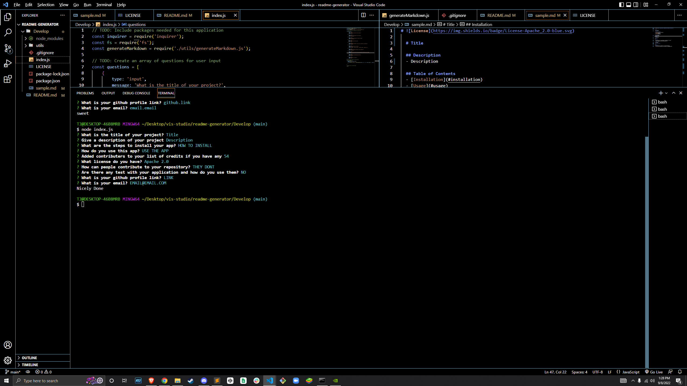

# Readme Generator

# What is this?
- This is a readme generator built using node.js that will prompt you to answer some questions and give you a template readme.md file for and project you may be working on
- I built this app as part of a requirement for my development certification as well as display of my work for future employers

# Installation
- If you do not have node downloaded on your machine, you will need to download node from https://nodejs.org/en/ 

- You will need VS. Code or another text editor that has a intergrated terminal 

- Clone this repository this repository to your machine

# Usage 
- To use this application you must have 'node' installed on your maching. Once inside of the repository file you will want to right click on "index.js" and select "open in intergrated terminal". You will now want to navigate to the bottom of V.S. Code to the terminal area and enter "node index.js" into the terminal and press enter. From there you will be prompted with questions as to what you readme should include. After the questions have been anwered, the results will be copied to the "sample.md" file. From there you may copy and paste your readme template wherever you would like to use it.

- Video is coming soon

## Credits
- The UofM Coding Bootcamp for the starter code
- The instructors at the UofM Coding Bootcamp for teaching me all the tools neccesary to complete this application
-The awesome assistants at askBCS for helping me when I found myself lost or stuck

